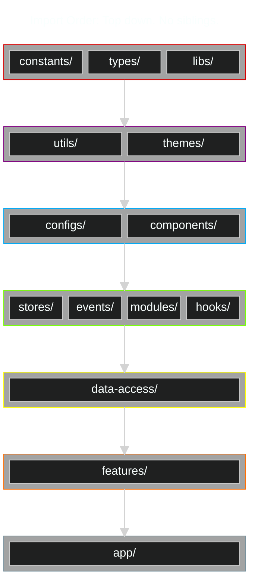

# Import Architecture

To ensure that we do not accidentally create a situation of circular imports or create confusion around what we should or should not be importing we have the following hierarchy established:

[Live link](https://mermaid.live/edit#pako:eNqFVMuumzAU_BXLVXYk5Q1hcaW2UaQu2i7KqqW6csAkVoyNjLm3KeLf6wcBsgoLPMdzZs4xthlgySsMM7jZDIAwIkEGBlBAecENLqCKClghcVVwHDebghXsRHl53Z6wRAUrOe0b1gGvYABIIin-XcCvTcuFBD9EhUUGct6Cir-zHfjOQUdOlLBztyvgHy0xXllu5ACUnHUSMdkpkxl_nFKV_63FmjLjMk3JSc_q4T6JWaWHrkUlXpXxraCXhGqFGVf2esnG34AnXsHcck3OU8MaLX4lV9-B4fty7sET39CKO8mFacaCxRW_TY4WLETDq54ayYQW6sL5VRNmfFI_MpIKSfSKyhJ3WqejrY2eqGNbsMZI9rb_O3wiTKwQta3SqPdDuga5B7bbF2D3MPdtYDYhD2xgvlwe2sAsI49sYLrKYxsk1q-TN4rtkVVY8CvOmNogpyaUGrQkqdJTxodD5KpnRfl3qu1FS9eiYBa5waf9MVxR4Uwl8fHoBisqmqmjeh5KxSsqPjxQyWKY7t39F-jABosGkUrd7EEnzjd6udCOna8pfy8vSEjNDXYb1HntxduU3Uncfsa1OoYF1PRYsFEVQL3kP2-shJkUPXag4P35ArMa0U5FfasODT4QdBaomWdbxH5x_hDDbIB_Yea58S7208jde6GfpGHqO_AGsyCJd1G0D0I_9tLYDYJodOA_Y-HukjBOQ99Pk8BLIkU7EFdEXZdv9o9mfmzjfzRQjVs)

## Testing RSCs

See [this Github issue](https://github.com/testing-library/react-testing-library/issues/1209#issuecomment-1569813305).

## Fetching Data

### RSC

- https://nextjs.org/docs/app/getting-started/data-fetching-and-streaming#server-components
- https://react.dev/reference/rsc/server-components#async-components-with-server-components

In this paradigm, the component will only stream to client once all promises in the component have fulfilled on the server. Note that unless wrapped in a `Promise.all()`, multiple `await` calls will execute serially. Refer to [sequential](https://nextjs.org/docs/app/building-your-application/data-fetching/fetching#sequential-data-fetching) and [parallel](https://nextjs.org/docs/app/building-your-application/data-fetching/fetching#parallel-data-fetching) data fetching sections of the nextjs docs for more info.

One of the larger downsides with this approach is that the component is not rendered until all promises in that component have been settled. Meaning, if you have a lengthy API request, the user may be met with an unsavory user experience. Note that you can get around this by wrapping the RSC in a `Suspense` boundary or by providing a `loading.tsx` file in the appropriate app router directory. Additionally, you can open the door to request waterfalls if a child of the component is also awaiting data in a RSC.

### Stream data from server to client

This has a small advantage over awaiting data on the server in that you can prevent the request waterfall situation from ocurring as easily. Additionally, if you are unable to physically request data during a `build` command then this can be more lucrative from a PPR perpsective. Structurally it looks almost identical to awaiting data in a RSC.

- https://nextjs.org/docs/app/getting-started/data-fetching-and-streaming#with-the-use-hook
- https://react.dev/reference/react/use

### Fetch data in client component

In our specific context there are only two situation in which you would want to use client fetching: long polling or infinite scrolling.

### References

- https://www.youtube.com/watch?v=VMDydLUCLtE
- https://www.youtube.com/watch?v=RBM03RihZVs
