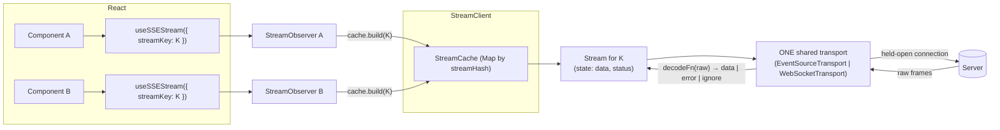
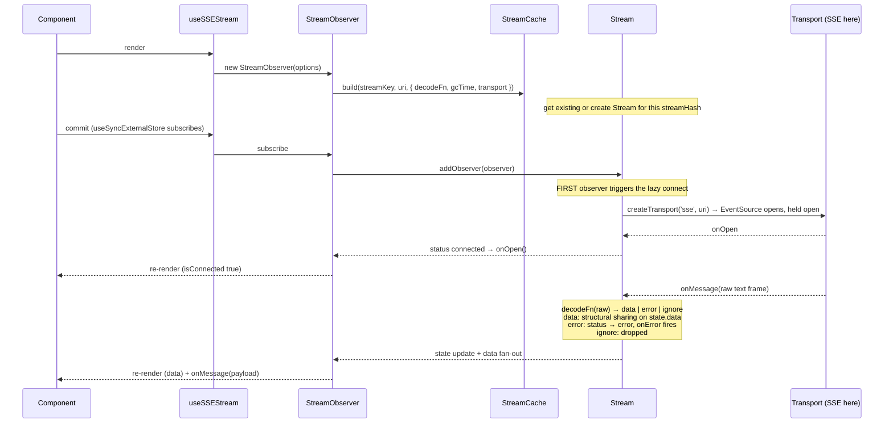
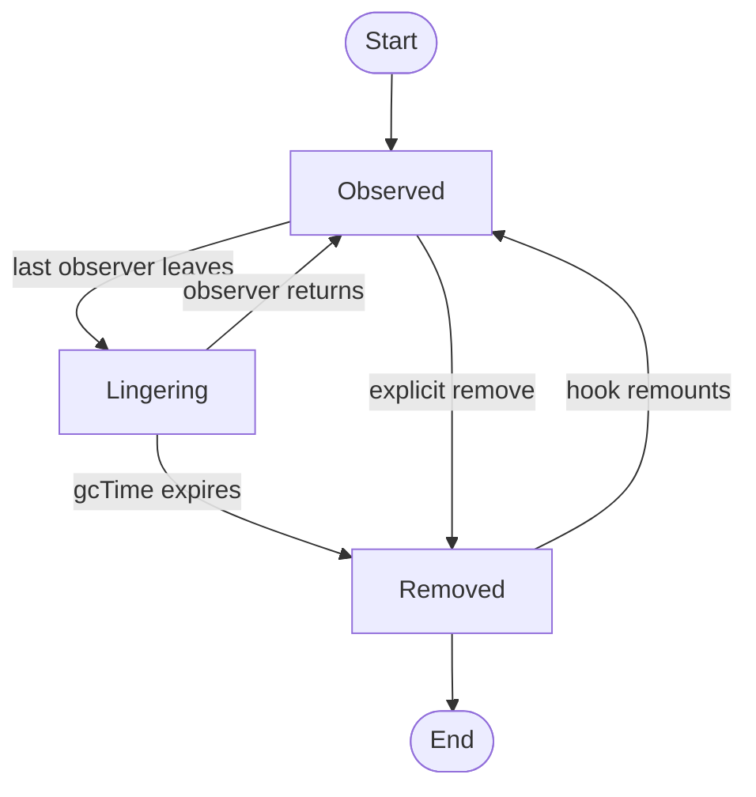

<!-- Copyright 2026 Hypergiant Galactic Systems Inc. All rights reserved.
This file is licensed to you under the Apache License, Version 2.0 (the "License");
you may not use this file except in compliance with the License. You may obtain a copy
of the License at https://www.apache.org/licenses/LICENSE-2.0
Unless required by applicable law or agreed to in writing, software distributed under
the License is distributed on an "AS IS" BASIS, WITHOUT WARRANTIES OR REPRESENTATIONS
OF ANY KIND, either express or implied. See the License for the specific language
governing permissions and limitations under the License. -->

# @accelint/stream

**TanStack Query for live streams.** This library manages held-open stream
connections (SSE or WebSocket) the way TanStack Query manages fetched data:
consumers ask for a stream by `streamKey`, and everyone using the same key
**shares one live connection**. If you know TanStack Query you already know
this library — same classes, same lifecycle, one different resource at the
center: instead of caching a *response*, we cache an *open connection*.

Two entry points, one package (the `@accelint/bus` pattern):

- **`@accelint/stream`** — the framework-agnostic core.
- **`@accelint/stream/react`** — the React hooks.

React is an **optional peer**: core-only consumers install and bundle zero
React — the `react/` modules are separate subpath exports that are never
loaded unless imported.

## The cast (1:1 with TanStack Query)

| This library | TanStack Query | What it is |
| --- | --- | --- |
| `useSSEStream()` / `useWebSocketStream()` | `useQuery()` | The hooks a component calls — same semantics, different wire protocol |
| `streamKey` / `streamHash` | `queryKey` / `queryHash` | Identity: everyone on the same key shares one stream |
| `decodeFn` | `queryFn` | The injected protocol boundary — the library never assumes a wire format |
| `StreamObserver` | `QueryObserver` | One per consumer; derives the result (`data`, `status`, flags) and fires callbacks |
| `Stream` | `Query` | One per `streamKey`; owns state and the network resource |
| `StreamCache` | `QueryCache` | `Map<streamHash, Stream>`; get-or-create + lifecycle events |
| `StreamClient` | `QueryClient` | Entry point holding the cache |
| `StreamClientProvider` / `useStreamClient` | `QueryClientProvider` / `useQueryClient` | React context wiring |
| `useStreamState(filters, select)` | `useMutationState` | Aggregate observation over the whole cache |
| `useStreamCount(filters)` | `useIsFetching` | Count of streams matching filters |
| Transport (`EventSource`/`WebSocket`, held open) | `queryFn` fetch (runs, then done) | **The one difference** — see below |
| `gcTime` linger | `gcTime` linger | Unobserved entries survive briefly for instant re-attach |

## Relationships



Two components, same `streamKey` → two observers, **one** `Stream`, **one**
socket. Exactly like two `useQuery(K)` calls sharing one cached query — except
the shared thing is a live connection.

## Lifecycle: mount → connect → message



Key points:

- **Render is side-effect free.** Creating the observer and building the
  `Stream` opens nothing. The connection starts when the first observer
  *subscribes* (React commit) — the same lazy pattern as TanStack Query only
  fetching when a query gains an active observer. SSR renders never connect.
- **`onMessage` fires for every message, even identical payloads.**
  `state.data` uses structural sharing (`replaceEqualDeep`, same as TanStack
  Query) so re-renders stay cheap, but SSE sources are *event emitters, not
  state replicators* — a repeated payload is still a new event. The event
  callback fires, but the component won't re-render if `data` reference is
  unchanged.

## Lifecycle: unmount → linger → gc (or re-attach)



This is TanStack Query's `gcTime` model verbatim: timer armed at creation and
on last-observer-removed, disarmed on observer-added, explicit removal
immediate. It makes StrictMode's dev-mode mount→unmount→mount, Suspense blips,
and quick route hops **free**: the returning observer picks up the same live
socket instead of tearing it down and reconnecting.

## Where the mental model differs from TanStack Query

A query's `queryFn` runs, resolves, and is *done* — caching its result is
pure win. A stream's transport connection is a **standing resource**: while
it is open, the server holds a socket and keeps sending. Consequences:

- **Lingering costs the server, not just client memory.** That is why the
  default `gcTime` is **30 seconds**, not TanStack's 5 minutes. Override per
  hook (`gcTime: 60_000`); the longest requested linger wins (ratchets up,
  `Infinity` disables gc) — same semantics as TanStack Query.
- **There is no "stale data" concept.** A live connection is never stale, so
  `staleTime` has no analog. The connection either exists or it doesn't.
- **`retry()` is the manual reconnect** (the browser's `EventSource` stops
  auto-reconnecting after fatal errors). It always works: if the stream was
  externally removed, retry re-resolves against the cache and opens a fresh
  connection.

## Transports

- **SSE (`useSSEStream`)** — `EventSource`; the browser reconnects natively
  (tuned by the server's `retry:` field).
- **WebSocket (`useWebSocketStream`)** — the browser never reconnects on its
  own, so the transport retries with doubling backoff (1s → 15s cap, reset
  on a successful open). `uri` accepts `http(s)://` (auto-converted to
  `ws(s)://`) or explicit `ws(s)://`. There is no client-side liveness watchdog
  (browsers cannot send WS pings) — WS endpoints must heartbeat like the
  SSE ones.

**A streamKey identifies one stream on one transport.** Requesting the same
key on a different transport (or a different uri) logs an error and keeps
serving the original stream.

## Setup (React)

```tsx
import { StreamClient } from '@accelint/stream';
import { StreamClientProvider } from '@accelint/stream/react';

const streamClient = new StreamClient();

function App({ children }) {
  return (
    <StreamClientProvider client={streamClient}>
      {children}
    </StreamClientProvider>
  );
}
```

## Usage

```tsx
import { useSSEStream } from '@accelint/stream/react';

function ComponentA() {
  const { data, status, isConnected, retry, pause, resume } = useSSEStream({
    streamKey: ['health', apiUri],
    uri: `${apiUri}/stream/health`,
    onMessage: (data) => console.log('A received:', data),
  });

  return <div>Status: {status}</div>;
}

// Shares the same connection (same streamKey)
function ComponentB() {
  const { data } = useSSEStream({
    streamKey: ['health', apiUri],
    uri: `${apiUri}/stream/health`,
  });

  return <div>Data: {JSON.stringify(data)}</div>;
}
```

### Options

- `streamKey` (required): stream identity. **Must include everything the
  `uri` derives from** (e.g. the host) — the `uri` is only read when the
  stream is first created.
- `uri` (required): the stream endpoint.
- `decodeFn`: turns one raw wire frame into
  `{ kind: 'data', data } | { kind: 'error', error } | { kind: 'ignore' }` —
  this library's `queryFn`. Defaults to JSON-as-data. Backend protocols
  (envelopes, keepalive filtering, server-declared errors) live in app-owned
  decoders, never in the library. Fixed when the stream is first created
  (first consumer wins, like `uri`).
- `enabled`: set `false` to not connect (default `true`).
- `gcTime`: unobserved linger (connection open) before gc. 30s browser
  default; ratchets up; `Infinity` disables.
- `select`: derive this observer's slice from stream data — QueryObserver
  semantics: memoized on (data identity, select identity), structurally
  shared so a deep-equal slice keeps its reference. `onMessage` stays raw —
  select shapes state, not events.
- `messageHistory`: retained-message cap for `messages` in the result.
  Default 0 (off — no retention cost); ratchets up across observers like
  `gcTime`. Entries stay raw even when `select` narrows `data`.
- `onOpen(status)` / `onError(status)`: fired on status transitions.
- `onMessage(data)`: fired for **every** message, including duplicates.
- `client`: override the context `StreamClient`.

### Result

`data`, `dataUpdatedAt`, `status` (`connecting | connected | error |
disconnected`), the derived booleans (`isConnecting`, `isConnected`,
`isError`, `isDisconnected`, `isEnabled`), `messages` (retained raw
messages, oldest first — empty until `messageHistory` is set; entries are
`{ data, dataUpdatedAt, sequence }` with consecutive duplicate payloads
sharing one `data` reference — ideal for a read-only chat/feed UI), and
three methods:

- `retry()`: close and reopen the underlying connection on either transport.
  Use after a fatal error — `EventSource` stops auto-reconnecting once the
  server rejects the connection, and the WebSocket backoff caps out.
  Re-resolves the stream from the cache first, so it also recovers a stream
  that was externally removed (e.g. devtools Close).
- `pause()` / `resume()`: detach/reacquire the stream for this observer.
  Resuming within the `gcTime` window re-attaches to the same live
  connection.

### Observing many streams at once

`useStreamState` is a `useSyncExternalStore` read over the cache itself, for
aggregate UI like a connection indicator — every way a stream can change or
end flows through the cache and lands here.

```tsx
const activationStreams = useStreamState({
  filters: { streamKey: ['activations'] }, // prefix match
  select: (stream) => ({
    id: (stream.streamKey[1] as { id: string }).id,
    status: stream.state.status,
  }),
});
```

Filters: `streamKey` (prefix-matched via TanStack's `partialMatchKey`;
`exact: true` for whole-key), `status`, `transport`, and `predicate` — the
arbitrary escape hatch. Pass `select` to narrow what triggers re-renders:
the result array is referentially stable (`replaceEqualDeep`) until the
selected data actually changes.

`useStreamCount(filters?)` is the `useIsFetching` analog — a
membership-stable count that re-renders only when it changes:

```tsx
const erroredCount = useStreamCount({ status: 'error' });
```

### Imperative access (core, no React)

```ts
import { StreamClient } from '@accelint/stream';

const client = new StreamClient();
client.getStreamState(['health', uri]);
client.getStreams({ status: 'error' });
client.getStreamCount({ transport: 'websocket' });
client.clear();
```

`StreamCache.subscribe()` observes every lifecycle event — this is how
`@accelint/stream-devtools` watches from the outside without this library
knowing it exists.

## Message history

Opt-in per stream via `messageHistory`: the stream keeps its last N raw
messages, readable via `stream.getMessages()` and surfaced by observers as
`messages`. `sequence` is the stream's `dataUpdateCount` at dispatch
(stable across ring-buffer eviction). History lives on the stream instance
and dies with it.

## DevTools

`@accelint/stream-devtools` adds a Streams tab to TanStack Devtools showing
every stream's status, observer count, message log, and lifecycle timeline,
with Reconnect / Close / Clear All / Simulate-Error / Inject-Message
actions.
