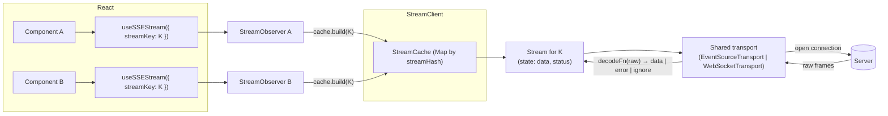
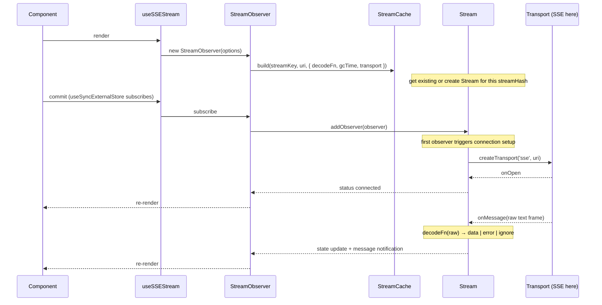

<!-- Copyright 2026 Hypergiant Galactic Systems Inc. All rights reserved.
This file is licensed to you under the Apache License, Version 2.0 (the "License");
you may not use this file except in compliance with the License. You may obtain a copy
of the License at https://www.apache.org/licenses/LICENSE-2.0
Unless required by applicable law or agreed to in writing, software distributed under
the License is distributed on an "AS IS" BASIS, WITHOUT WARRANTIES OR REPRESENTATIONS
OF ANY KIND, either express or implied. See the License for the specific language
governing permissions and limitations under the License. -->

# @accelint/stream

Cache and share SSE and WebSocket connections by key.

`@accelint/stream` manages held-open browser stream connections. Consumers use
`streamKey` as the stream identity. Consumers with the same key share one
connection.

The package has two entry points:

- `@accelint/stream` — framework-agnostic core APIs
- `@accelint/stream/react` — React hooks and provider

React is an optional peer dependency. Core-only consumers do not need to load
React.

## Installation

```bash
pnpm add @accelint/stream
```

### Peer dependencies

Install React only if you use `@accelint/stream/react`.

```bash
pnpm add react
```

TypeScript types are included.

## Quick Start

```tsx
import { StreamClient } from '@accelint/stream';
import { StreamClientProvider, useSSEStream } from '@accelint/stream/react';

const client = new StreamClient();

function HealthStatus({ apiUri }: { apiUri: string }) {
  const { data, status } = useSSEStream<{ status: string }>({
    streamKey: ['health', apiUri],
    uri: `${apiUri}/stream/health`,
  });

  return <pre>{JSON.stringify({ status, data }, null, 2)}</pre>;
}

export function App({ apiUri }: { apiUri: string }) {
  return (
    <StreamClientProvider client={client}>
      <HealthStatus apiUri={apiUri} />
    </StreamClientProvider>
  );
}
```

## What is @accelint/stream?

`@accelint/stream` is a cache and observer layer for live browser streams. It
supports Server-Sent Events and WebSocket transports. It provides shared-key
stream reuse, lazy connection setup, observer results, and cache-wide state
inspection. This library is heavily inspired by tanstack query.

The core package works without React. The React subpath adds hooks and a
provider.

## Why use @accelint/stream?

This package helps when multiple consumers need to share stream lifecycle and
state.

It provides:

- shared connections by `streamKey`
- lazy connection setup on first subscription
- short unobserved linger through `gcTime`
- SSE and WebSocket support through the same cache model
- cache-wide inspection for counts and filtered state

## TanStack Query mapping

| `@accelint/stream` | TanStack Query | Description |
| --- | --- | --- |
| `useSSEStream()` / `useWebSocketStream()` | `useQuery()` | Hook-level stream access |
| `streamKey` / `streamHash` | `queryKey` / `queryHash` | Stream identity |
| `decodeFn` | `queryFn` | Raw frame decoder |
| `StreamObserver` | `QueryObserver` | Per-consumer observer |
| `Stream` | `Query` | One shared stream per key |
| `StreamCache` | `QueryCache` | Cache of streams |
| `StreamClient` | `QueryClient` | Cache owner and imperative API |
| `StreamClientProvider` / `useStreamClient` | `QueryClientProvider` / `useQueryClient` | React context wiring |
| `useStreamState(filters, select)` | `useMutationState` | Cache-wide observation |
| `useStreamCount(filters)` | `useIsFetching` | Count of matching streams |
| `gcTime` linger | `gcTime` linger | Unobserved retention window |

## Relationships



Consumers with the same `streamKey` share one `Stream` instance and one
transport connection.

## Lifecycle

### Mount, connect, and message flow



Facts:

- Render does not open a connection.
- The connection starts when the first observer subscribes.
- SSR renders do not connect.
- `onMessage` runs for every message, including duplicate payloads.
- `state.data` uses structural sharing, so equal payloads can keep the same
  reference.

### Unmount, linger, and removal


When the last observer unsubscribes, the stream remains in the cache until
`gcTime` expires. If another observer subscribes before that, the same stream
is reused.

## Differences from TanStack Query

- A stream holds an open network connection.
- Default `gcTime` is 30 seconds.
- There is no `staleTime` concept.
- `retry()` closes and reopens the connection.

## Transports

- `useSSEStream` uses `EventSource`. Browser reconnect behavior follows the
  server's `retry:` configuration.
- `useWebSocketStream` uses WebSocket transport with client-side reconnect
  backoff.
- WebSocket URIs can be `http(s)://` or `ws(s)://`. `http(s)` is converted to
  `ws(s)`.
- A `streamKey` identifies one stream on one transport. If the same key is
  reused with a different transport or URI, the existing stream remains in
  use and the package logs an error.

## API

### `StreamClient`

Owns a `StreamCache` and provides imperative reads.

```ts
const client = new StreamClient();
```

Key methods:

- `getStreamCache()`
- `getStreamState(streamKey)`
- `getStreams(filters?)`
- `getStreamCount(filters?)`
- `getStreamKeys()`
- `clear()`

### `StreamCache`

Stores `Stream` instances by hashed `streamKey`.

Important behavior:

- `streamKey` is the identity, not `uri`
- later observers can increase `gcTime` and `messageHistory`, but do not lower
  them
- reusing the same key with a different `uri` or transport logs an error and
  keeps the existing stream

### `Stream`

Represents one shared live connection and its current state.

Useful surface:

- `state` — `{ data, dataUpdateCount, dataUpdatedAt, status }`
- `getMessages()` — retained raw messages when `messageHistory > 0`
- `getTransport()` — current live transport instance, if connected
- `getEventSource()` — underlying `EventSource` for SSE streams
- `retry()` — close and reopen the connection
- `close()` — tear down the current connection

### `StreamObserver`

Per-consumer observer used by the React hooks. It applies `select`, tracks
enabled state, and exposes the observer result.

### `useSSEStream(options)`

React hook for SSE streams.

| Option | Type | Description |
| --- | --- | --- |
| `streamKey` | `readonly unknown[]` | Stream identity. Include all values the `uri` depends on. |
| `uri` | `string` | SSE endpoint. |
| `decodeFn` | `DecodeFn<T>` | Converts a raw frame into `data`, `error`, or `ignore`. |
| `enabled` | `boolean` | Skip connecting when `false`. |
| `gcTime` | `number` | Unobserved linger before removal. |
| `select` | `(data: T) => TData` | Observer-specific derived slice. |
| `messageHistory` | `number` | Retain the last N raw messages. |
| `onOpen` | `(status: StreamStatus) => void` | Called when the connection opens. |
| `onMessage` | `(data: T) => void` | Called for every message. |
| `onError` | `(status: StreamStatus) => void` | Called when the stream errors. |
| `client` | `StreamClient` | Optional client override instead of context. |

**Returns:** `StreamObserverResult<TData, T>` with `data`, `messages`,
`status`, derived booleans, and `retry()`, `pause()`, `resume()`.

### `useWebSocketStream(options)`

Same result shape as `useSSEStream`, but uses WebSocket transport.

Notable differences:

- accepts `http(s)://` or `ws(s)://` URIs
- converts `http(s)` to `ws(s)` automatically
- retries closed sockets with doubling backoff

### `useStream(options)`

Transport-agnostic React hook used by both transport-specific hooks.

### `useStreamState(options?, client?)`

Observes cache-wide stream state.

Filters support:

- `streamKey` prefix matching
- `exact: true` for whole-key matching
- `status`
- `transport`
- `predicate(stream)` for custom filtering

Use `select(stream)` to project each matching stream into a smaller result.

### `useStreamCount(filters?, client?)`

Counts streams matching a filter set. It re-renders when membership changes.

### `defaultDecodeFn(raw)`

Parses each raw message as JSON and treats the result as stream data.

### `createTransport(kind, uri, handlers)`

Creates an `EventSourceTransport` or `WebSocketTransport` instance.

### `toWebSocketUri(uri)`

Converts `http://` to `ws://` and `https://` to `wss://`. Existing `ws://`
and `wss://` URIs are returned unchanged.

### `STREAM_STATUS`

Status constants exported by the package:

```ts
const STREAM_STATUS = {
  CONNECTING: 'connecting',
  CONNECTED: 'connected',
  ERROR: 'error',
  DISCONNECTED: 'disconnected',
} as const;
```

## Examples

### Setup (React)

```tsx
import { StreamClient } from '@accelint/stream';
import { StreamClientProvider } from '@accelint/stream/react';

const streamClient = new StreamClient();

function App({ children }) {
  return (
    <StreamClientProvider client={streamClient}>
      {children}
    </StreamClientProvider>
  );
}
```

### Shared SSE connection in multiple components

```tsx
import { useSSEStream } from '@accelint/stream/react';

function ComponentA() {
  const { data, status } = useSSEStream({
    streamKey: ['health', apiUri],
    uri: `${apiUri}/stream/health`,
  });

  return <div>Status: {status}</div>;
}

function ComponentB() {
  const { data } = useSSEStream({
    streamKey: ['health', apiUri],
    uri: `${apiUri}/stream/health`,
  });

  return <div>Data: {JSON.stringify(data)}</div>;
}
```

### Common options

- `streamKey` — stream identity. Include all values the `uri` depends on.
- `uri` — stream endpoint.
- `decodeFn` — converts raw frames into `data`, `error`, or `ignore`.
- `enabled` — set `false` to skip connecting.
- `gcTime` — unobserved linger before removal.
- `select` — per-observer derived slice of `data`.
- `messageHistory` — retained message count for `messages`.
- `onOpen` / `onError` — status callbacks.
- `onMessage` — called for every message.
- `client` — optional `StreamClient` override.

### Result shape

The observer result includes:

- `data`
- `dataUpdatedAt`
- `status`
- `isConnecting`
- `isConnected`
- `isError`
- `isDisconnected`
- `isEnabled`
- `messages`
- `retry()`
- `pause()`
- `resume()`

`messages` is empty until `messageHistory` is set.

### Observe many streams at once

```tsx
const activationStreams = useStreamState({
  filters: { streamKey: ['activations'] },
  select: (stream) => ({
    id: (stream.streamKey[1] as { id: string }).id,
    status: stream.state.status,
  }),
});
```

`useStreamCount(filters?)` returns the number of matching streams.

```tsx
const erroredCount = useStreamCount({ status: 'error' });
```

### Imperative access without React

```ts
import { StreamClient } from '@accelint/stream';

const client = new StreamClient();
client.getStreamState(['health', uri]);
client.getStreams({ status: 'error' });
client.getStreamCount({ transport: 'websocket' });
client.clear();
```

`StreamCache.subscribe()` emits cache lifecycle events.

### Message history

Set `messageHistory` to retain the last N raw messages. Read retained entries
through `messages` on the observer result or `stream.getMessages()` on the
stream instance.

### WebSocket transport and URI conversion

```tsx
import { useWebSocketStream } from '@accelint/stream/react';

function StatsSocket({ cortexUri }: { cortexUri: string }) {
  const { data, isConnected } = useWebSocketStream<{ tick: number }>({
    streamKey: ['cortex-stats-ws', cortexUri],
    uri: `${cortexUri}/ws/health`,
  });

  return <div>{isConnected ? data?.tick : 'connecting'}</div>;
}
```

### Select a stable slice per observer

```tsx
type Frame = {
  cpu: { load: number };
  memory: { used: number };
};

const { data: cpu } = useSSEStream<Frame, Frame['cpu']>({
  streamKey: ['stats', apiUri],
  uri: `${apiUri}/stream/stats`,
  select: (frame) => frame.cpu,
});
```

If the full frame changes but the selected slice stays deep-equal, the hook
can keep the same `data` reference.

### Custom frame decoding

```tsx
import type { DecodeFn, StreamFrame } from '@accelint/stream';

const decodeFn: DecodeFn<{ value: number }> = (raw): StreamFrame<{ value: number }> => {
  const frame = JSON.parse(raw) as
    | { type: 'data'; value: number }
    | { type: 'heartbeat' }
    | { type: 'error'; message: string };

  if (frame.type === 'heartbeat') {
    return { kind: 'ignore' };
  }

  if (frame.type === 'error') {
    return { kind: 'error', error: frame.message };
  }

  return { kind: 'data', data: { value: frame.value } };
};
```

### Filter cache state by named key segments

```tsx
const activationStreams = useStreamState({
  filters: {
    streamKey: ['cortex', 'activations', { datasetId: 'dataset-b' }],
  },
  select: (stream) => ({
    datasetId: (stream.streamKey[2] as { datasetId: string }).datasetId,
    status: stream.state.status,
  }),
});
```

Object segments inside `streamKey` use deep partial matching.

## Further Reading

- [`src/stream-cache.ts`](./src/stream-cache.ts) - cache creation and key conflict behavior
- [`src/stream-observer.ts`](./src/stream-observer.ts) - observer result semantics and callbacks
- [`src/transport.ts`](./src/transport.ts) - SSE and WebSocket transport behavior
- [`src/react/use-stream-state.ts`](./src/react/use-stream-state.ts) - cache-wide React observation

## DevTools

`@accelint/stream-devtools` adds a Streams tab to TanStack Devtools showing
every stream's status, observer count, message log, and lifecycle timeline,
with Reconnect / Close / Clear All / Simulate-Error / Inject-Message
actions.

## License

Apache-2.0 - see [LICENSE](../../LICENSE) for details.

## Contributing

Contributions are welcome. Read [../../CONTRIBUTING.md](../../CONTRIBUTING.md)
before opening a pull request.

```bash
pnpm test --dir=src
pnpm build
```
